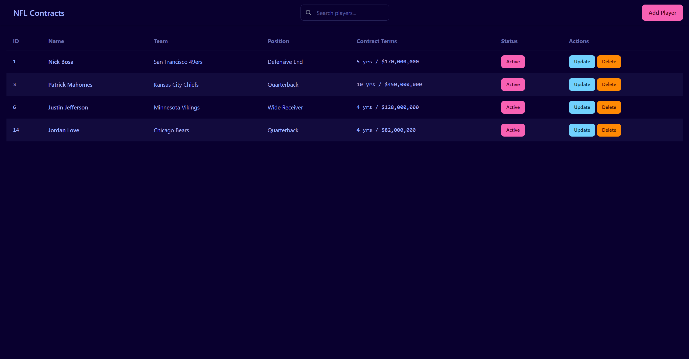

# NFL Contract Manager
A streamlined CRUD (Create, Read, Update, Delete) web application for managing NFL player profiles with a core focus on tracking financial contract details.

## 🎯 Purpose
To simplify the complex task of managing NFL salaries, providing a clear and centralized system for team administrators, agents, or analysts to track one of the most valuable assets in the league: player contracts.

## Tech Stack

**Server:** Node, Express, Postgresql, React (TypeScript), DaisyUI, TailwindCSS

## Screenshot


## Endpoints
### Players
#### Get All Players
```http
GET /api/v1/players
```

Example Response Payload:
```javascript
{
    "success": true,
    "data": [
        {
            "id": 1,
            "player_name": "Dak Prescott",
            "team_name": "Dallas Cowboys",
            "position_name": "Quarterback",
            "contractvalue": 240000000,
            "contractyears": 4,
            "isactive": true
        },
        {
            "id": 3,
            "player_name": "Patrick Mahomes",
            "team_name": "Kansas City Chiefs",
            "position_name": "Quarterback",
            "contractvalue": 450000000,
            "contractyears": 10,
            "isactive": true
        },
        {
            "id": 4,
            "player_name": "Nick Bosa",
            "team_name": "San Francisco 49ers",
            "position_name": "Defensive End",
            "contractvalue": 170000000,
            "contractyears": 5,
            "isactive": false
        },
        {
            "id": 5,
            "player_name": "CeeDee Lamb",
            "team_name": "Dallas Cowboys",
            "position_name": "Wide Receiver",
            "contractvalue": 136000000,
            "contractyears": 4,
            "isactive": true
        }
    ],
    "count": 4
}
```

#### Get Player
```http
GET /api/v1/players/:id
```

Example Response Payload:
```javascript
{
    "success": true,
    "data": {
        "id": 1,
        "player_name": "Dak Prescott",
        "team_name": "Dallas Cowboys",
        "position_name": "Quarterback",
        "contractvalue": 240000000,
        "contractyears": 4,
        "isactive": true
    }
}
```

#### Create Player
```http
POST /api/v1/players
```

Example Request Payload:
```javascript
{
    "name": "Justin Jefferson",
    "team_id": "21",
    "position_id": "3",
    "contractValue": "128000000",
    "contractYears": "4"
}
```

Example Response Payload:
```javascript
{
    "success": true,
    "message": "Player created successfully",
    "data": {
        "id": 6,
        "name": "Justin Jefferson",
        "team_id": 21,
        "position_id": 3,
        "contractvalue": 128000000,
        "contractyears": 4,
        "isactive": true
    }
}
```

#### Update Player
```http
PUT /api/v1/players/:id
```

Example Request Payload:
```javascript
{
    "name": "Nick Bosa",
    "team_id": "28",
    "position_id": "13",
    "contractValue": "170000000",
    "contractYears": "5"
}
```

Example Response Payload:
```javascript
{
    "success": true,
    "message": "Player updated successfully",
    "data": {
        "id": 1,
        "name": "Nick Bosa",
        "team_id": 28,
        "position_id": 13,
        "contractvalue": 170000000,
        "contractyears": 5,
        "isactive": true
    }
}
```

#### Delete Player
```http
DELETE /api/v1/players/:id
```

Example Response Payload:
```javascript
{
    "success": true,
    "message": "Player permanently deleted successfully",
    "data": {
        "id": 4,
        "name": "Nick Bosa",
        "team_id": 28,
        "position_id": 13,
        "contractvalue": 170000000,
        "contractyears": 5,
        "isactive": true
    }
}
```

#### Toggle Player Status
```http
PATCH /api/v1/players/:id/status
```

Example Request Payload:
```javascript
{
    "isActive": "true"
}
```

Example Response Payload:
```javascript
{
    "success": true,
    "message": "Player permanently deleted successfully",
    "data": {
        "id": 4,
        "name": "Nick Bosa",
        "team_id": 28,
        "position_id": 13,
        "contractvalue": 170000000,
        "contractyears": 5,
        "isactive": true
    }
}
```

#### Search Player
```http
GET /api/v1/players/search?name=dak%20prescott
```

Example Response Payload:
```javascript
{
    "success": true,
    "data": [
        {
            "id": 1,
            "player_name": "Dak Prescott",
            "team_name": "Dallas Cowboys",
            "position_name": "Quarterback",
            "contractvalue": 240000000,
            "contractyears": 4,
            "isactive": true
        }
    ],
    "count": 1,
    "searchTerm": "dak prescott",
    "searchMode": "partial"
}
```

### Teams
```http
GET /api/v1/teams
```

Example Response Payload:
```javascript
{
    "success": true,
    "data": [
        {
            "id": 1,
            "name": "Arizona Cardinals",
            "isactive": true
        },
        {
            "id": 2,
            "name": "Atlanta Falcons",
            "isactive": true
        },
        {
            "id": 3,
            "name": "Baltimore Ravens",
            "isactive": true
        },
        {
            "id": 4,
            "name": "Buffalo Bills",
            "isactive": true
        },
        {
            "id": 5,
            "name": "Carolina Panthers",
            "isactive": true
        },
        {
            "id": 6,
            "name": "Chicago Bears",
            "isactive": true
        },
        {
            "id": 7,
            "name": "Cincinnati Bengals",
            "isactive": true
        },
        {
            "id": 8,
            "name": "Cleveland Browns",
            "isactive": true
        },
        {
            "id": 9,
            "name": "Dallas Cowboys",
            "isactive": true
        },
        {
            "id": 10,
            "name": "Denver Broncos",
            "isactive": true
        },
        {
            "id": 11,
            "name": "Detroit Lions",
            "isactive": true
        },
        {
            "id": 12,
            "name": "Green Bay Packers",
            "isactive": true
        },
        {
            "id": 13,
            "name": "Houston Texans",
            "isactive": true
        },
        {
            "id": 14,
            "name": "Indianapolis Colts",
            "isactive": true
        },
        {
            "id": 15,
            "name": "Jacksonville Jaguars",
            "isactive": true
        },
        {
            "id": 16,
            "name": "Kansas City Chiefs",
            "isactive": true
        },
        {
            "id": 17,
            "name": "Las Vegas Raiders",
            "isactive": true
        },
        {
            "id": 18,
            "name": "Los Angeles Chargers",
            "isactive": true
        },
        {
            "id": 19,
            "name": "Los Angeles Rams",
            "isactive": true
        },
        {
            "id": 20,
            "name": "Miami Dolphins",
            "isactive": true
        },
        {
            "id": 21,
            "name": "Minnesota Vikings",
            "isactive": true
        },
        {
            "id": 22,
            "name": "New England Patriots",
            "isactive": true
        },
        {
            "id": 23,
            "name": "New Orleans Saints",
            "isactive": true
        },
        {
            "id": 24,
            "name": "New York Giants",
            "isactive": true
        },
        {
            "id": 25,
            "name": "New York Jets",
            "isactive": true
        },
        {
            "id": 26,
            "name": "Philadelphia Eagles",
            "isactive": true
        },
        {
            "id": 27,
            "name": "Pittsburgh Steelers",
            "isactive": true
        },
        {
            "id": 28,
            "name": "San Francisco 49ers",
            "isactive": true
        },
        {
            "id": 29,
            "name": "Seattle Seahawks",
            "isactive": true
        },
        {
            "id": 30,
            "name": "Tampa Bay Buccaneers",
            "isactive": true
        },
        {
            "id": 31,
            "name": "Tennessee Titans",
            "isactive": true
        },
        {
            "id": 32,
            "name": "Washington Commanders",
            "isactive": true
        }
    ],
    "count": 32
}
```

### Positions
```http
GET /api/v1/positions
```

Example Response Payload:
```javascript
{
    "success": true,
    "data": [
        {
            "id": 1,
            "name": "Quarterback",
            "isactive": true
        },
        {
            "id": 2,
            "name": "Running Back",
            "isactive": true
        },
        {
            "id": 3,
            "name": "Wide Receiver",
            "isactive": true
        },
        {
            "id": 4,
            "name": "Tight End",
            "isactive": true
        },
        {
            "id": 5,
            "name": "Offensive Guard",
            "isactive": true
        },
        {
            "id": 6,
            "name": "Right Guard",
            "isactive": true
        },
        {
            "id": 7,
            "name": "Left Guard",
            "isactive": true
        },
        {
            "id": 8,
            "name": "Offensive Tackle",
            "isactive": true
        },
        {
            "id": 9,
            "name": "Right Tackle",
            "isactive": true
        },
        {
            "id": 10,
            "name": "Left Tackle",
            "isactive": true
        },
        {
            "id": 11,
            "name": "Center",
            "isactive": true
        },
        {
            "id": 12,
            "name": "Defensive Tackle",
            "isactive": true
        },
        {
            "id": 13,
            "name": "Defensive End",
            "isactive": true
        },
        {
            "id": 14,
            "name": "Middle Linebacker",
            "isactive": true
        },
        {
            "id": 15,
            "name": "Outside Linebacker",
            "isactive": true
        },
        {
            "id": 16,
            "name": "Cornerback",
            "isactive": true
        },
        {
            "id": 17,
            "name": "Safety",
            "isactive": true
        },
        {
            "id": 18,
            "name": "Free Safety",
            "isactive": true
        },
        {
            "id": 19,
            "name": "Strong Safety",
            "isactive": true
        },
        {
            "id": 20,
            "name": "Long Snapper",
            "isactive": true
        },
        {
            "id": 21,
            "name": "Kicker",
            "isactive": true
        },
        {
            "id": 22,
            "name": "Punter",
            "isactive": true
        }
    ],
    "count": 22
}
```

## Run Locally

Clone the project

```bash
  git clone https://link-to-project
```

Go to the project directory
In Terminal 1: 
```bash
  cd frontend
```

In Terminal 2: 
```bash
  cd backend
```

Install dependencies
In Terminal 1 and 2: 
```bash
  npm install
```

Start the server
In Terminal 1 and 2: 
```bash
  npm run dev
```

## License

MIT License

Copyright (c) [2025] [dotnickcore]

Permission is hereby granted, free of charge, to any person obtaining a copy
of this software and associated documentation files (the "Software"), to deal
in the Software without restriction, including without limitation the rights
to use, copy, modify, merge, publish, distribute, sublicense, and/or sell
copies of the Software, and to permit persons to whom the Software is
furnished to do so, subject to the following conditions:

The above copyright notice and this permission notice shall
